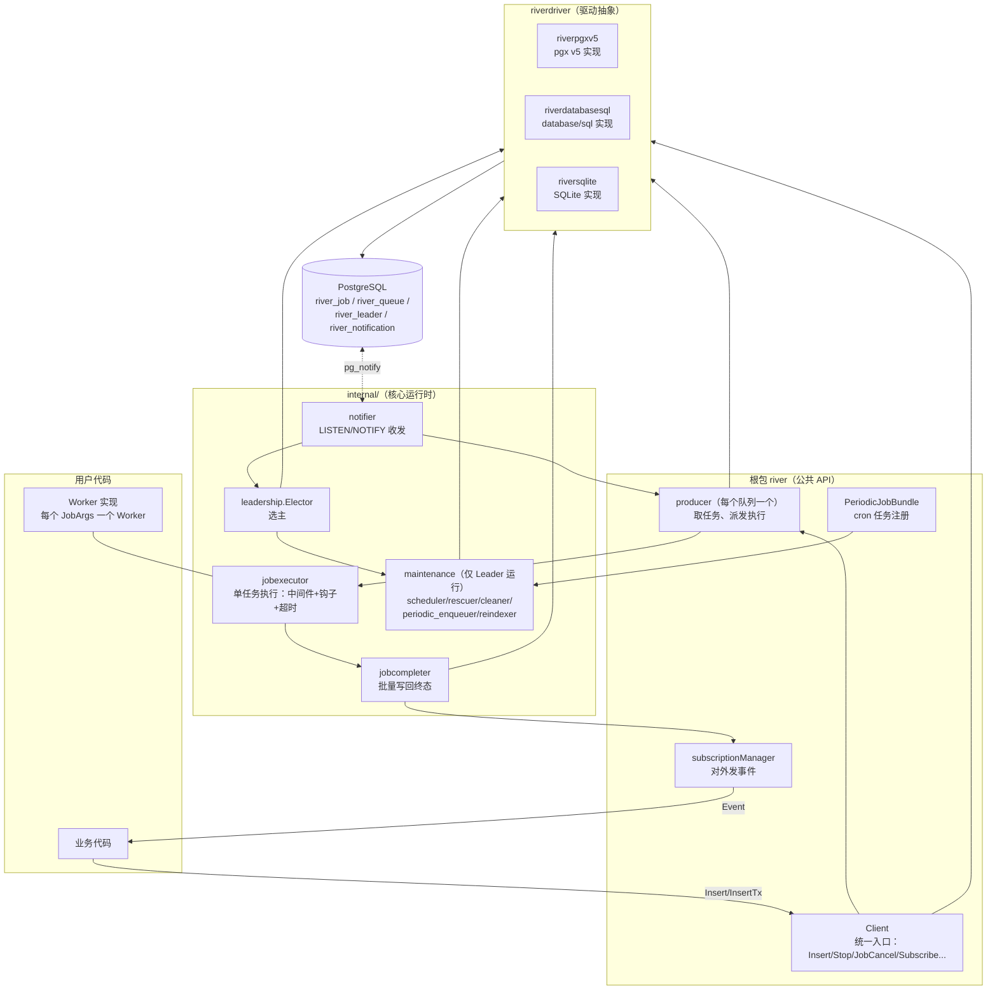
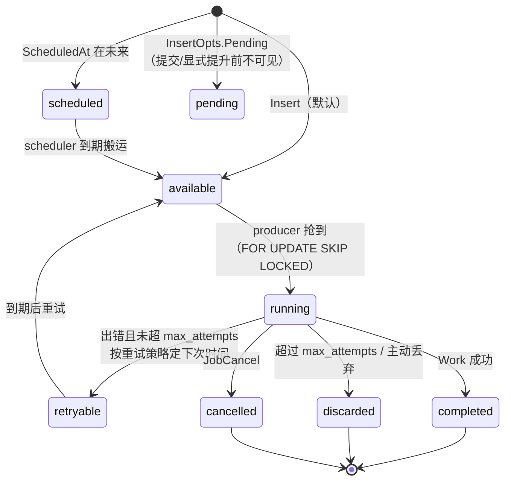
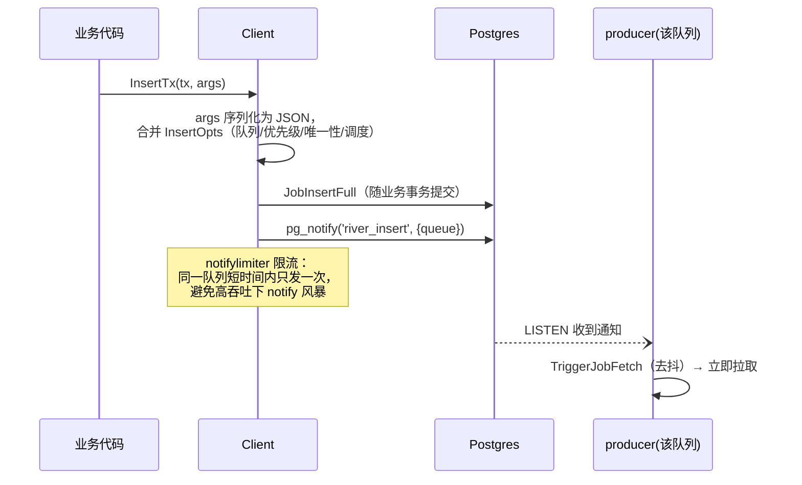
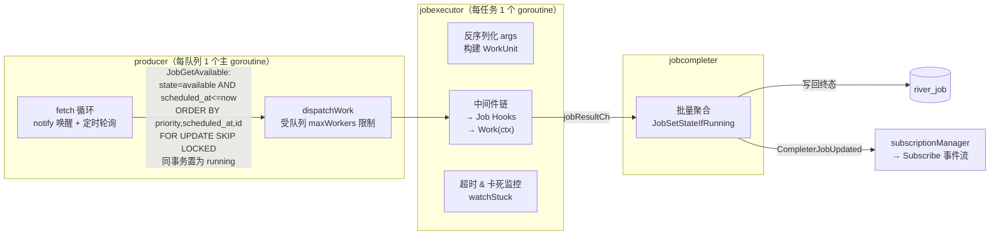
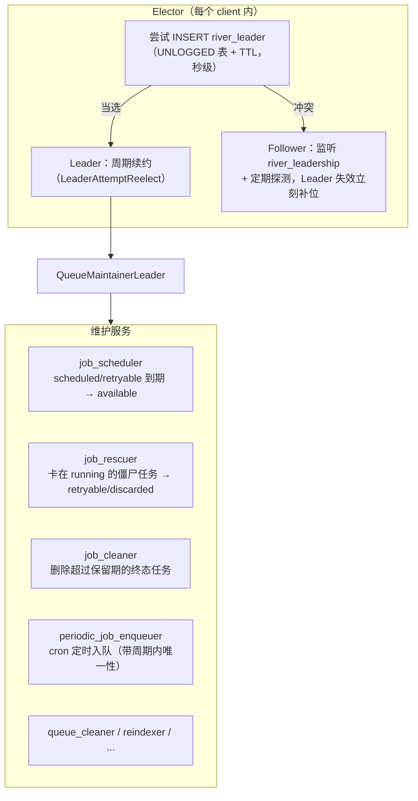

# 01｜River 架构鸟瞰

- 目标：以鸟瞰视角理解 River（`github.com/riverqueue/river` v0.47.0，源码在 `codes/river/`）的整体架构、主要模块与数据流，回答两个问题：它能做什么、是怎么做到的。
- 适配：Go + PostgreSQL；自顶向下分层展开，先架构全貌，再数据模型，再三条核心数据流，最后模块速览与能力清单。

## 1. 定位与设计哲学

River 是 Go + PostgreSQL 的任务队列：**用已有的 Postgres 存任务，不引入 Redis/Kafka 等额外组件**。核心哲学是**事务性入队**（transactional enqueueing）——任务和业务数据写进同一个事务，事务提交则任务一定存在、回滚则一定不存在，避免了"业务写成功但任务丢了"这类分布式一致性问题。

一个进程里的 Client 同时承担两个角色：**生产者**（调用 `Insert` 入队）和**消费者**（内部 producer 拉取并执行 Worker）。

## 2. 顶层架构

关键分层：**根包**是对外 API，**internal** 是运行时机制，**riverdriver** 把所有 SQL 抽象成 `Executor` 接口（约 40 个操作，见 [river_driver_interface.go](../../codes/river/riverdriver/river_driver_interface.go)），所以同一套核心逻辑可以跑在 pgx、database/sql、SQLite 上。

## 3. 核心数据模型：river_job 状态机

所有机制都围绕 `river_job` 表的一个状态字段（[river_job.sql](../../codes/river/riverdriver/riverpgxv5/internal/dbsqlc/river_job.sql)）：

表上的其他字段支撑对应功能：`priority`（1-4）、`queue`、`unique_key + unique_states`（唯一性）、`errors jsonb[]`（每次失败的错误历史）、`metadata`（取消标记等）、`finalized_at`（终态时间，配套 CHECK 约束保证一致性）。

## 4. 数据流

### 4.1 入队（生产者侧）

要点：

- **正常路径靠 LISTEN/NOTIFY 唤醒，轮询做兜底**（producer 有 jitter 轮询循环，所以 notify 丢失只是延迟、不丢任务；驱动不支持 LISTEN 时退化为纯轮询模式）
- 事务内插入意味着**提交前其他消费者看不到这条任务**，天然原子

### 4.2 消费（producer → executor → completer）

三个组件各管一段，职责单一：

- **producer**（[producer.go](../../codes/river/producer.go)）：只管"取多少、派给谁"，通过 `SKIP LOCKED` 保证多消费者实例抢同一批任务不冲突、不阻塞
- **jobexecutor**（[internal/jobexecutor](../../codes/river/internal/jobexecutor/)）：单任务生命周期——中间件、hook、超时控制、出错时按 retry policy 算下次执行时间、卡死检测
- **jobcompleter**（[internal/jobcompleter](../../codes/river/internal/jobcompleter/)）：把执行结果**异步批量**写回 DB（`JobSetStateIfRunning` 只在任务仍是 running 时生效，防止覆盖人工取消等并发操作），并驱动事件流

### 4.3 维护（选主 + Leader 独占的后台服务）

多客户端实例中同时只能有一个 Leader 运行维护任务，避免重复劳动：

选主不是为任务分发（那是 `SKIP LOCKED` 干的），只为**去重跑后台维护**：搬到期任务、清理垃圾、跑 cron。Leader 挂掉后 lease 过期，follower 秒级接管。

## 5. 模块速览

| 模块 | 位置 | 核心功能 |
|---|---|---|
| Client | [client.go](../../codes/river/client.go) | 对外门面：入队（4 种 Insert 变体）、任务管理（Cancel/Delete/Retry/Get）、生命周期、订阅事件、动态增删队列 |
| producer | [producer.go](../../codes/river/producer.go) | 每队列一个；fetch/dispatch 循环、队列暂停恢复、优雅停机（等在跑任务结束） |
| jobexecutor | [internal/jobexecutor](../../codes/river/internal/jobexecutor/) | 单任务执行：中间件 → hooks → `Work()`，超时/卡死/错误处理/重试时间计算 |
| jobcompleter | [internal/jobcompleter](../../codes/river/internal/jobcompleter/) | 终态批量写回 + 事件分发 |
| notifier | [internal/notifier](../../codes/river/internal/notifier/) | 一条专用连接上的 LISTEN，分发三个 topic：`river_insert` / `river_control`（取消、暂停）/ `river_leadership` |
| leadership | [internal/leadership](../../codes/river/internal/leadership/) | 基于 `river_leader` 表 + TTL 的选主、续约、辞职 |
| maintenance | [internal/maintenance](../../codes/river/internal/maintenance/) | Leader 独占的后台服务组（见上图） |
| riverdriver | `codes/river/riverdriver/` | 驱动抽象 + pgx v5 / database/sql / SQLite 三个实现；SQL 全部以 sqlc 管理 |
| rivertype | `codes/river/rivertype/` | 跨包共享类型：`JobRow`、状态常量、hook/插件接口 |
| rivermigrate / rivertest | 根下子模块 | 迁移管理 / 测试断言工具 |

## 6. 由架构推出的能力清单

对照上面的机制，River 开箱提供：

| 能力 | 依靠的机制 |
|---|---|
| 事务性入队（与业务数据同事务） | `InsertTx` + Postgres 事务可见性 |
| 至少一次执行 + 自动重试 | `retryable` 状态 + retry policy（默认指数退避）+ `max_attempts` 后丢弃 |
| 定时/延迟任务 | `scheduled` 状态 + Leader 的 scheduler 到期搬运 |
| cron 周期任务 | periodic_job_enqueuer + 周期内唯一性 |
| 任务唯一性 | `unique_key` + `unique_states` 位图，DB 层保证 |
| 多实例横向扩展 | `FOR UPDATE SKIP LOCKED` 抢占，无中心协调 |
| 取消运行中/排队任务 | `JobCancel` → `river_control` 通知 → executor 取消 context |
| 队列暂停/恢复、优先级、多队列 | `river_queue` 元数据 + fetch 排序规则 |
| 卡死检测（进程崩溃遗留 running 任务） | Leader 的 rescuer 定期扫描 |
| 事件流（insert/start/fail/retry/complete...） | completer → subscriptionManager → `Subscribe` channel |
| 优雅停机（等任务跑完 vs 强制取消） | `Stop` / `StopAndCancel` 两段式关闭 |
| 自定义中间件、hook、错误处理器、重试策略 | jobexecutor 的扩展点（middleware / hook 接口） |

## 7. 一句话总结

**River = 一张带状态机的 `river_job` 表 + 抢占式消费循环 + LISTEN/NOTIFY 加速唤醒 + 每实例一个的 Leader 维护后台**。所有可靠性保证（不丢、不重跑调度错乱、崩溃恢复）最终都落在 Postgres 的事务和行锁语义上。
