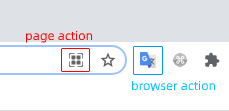
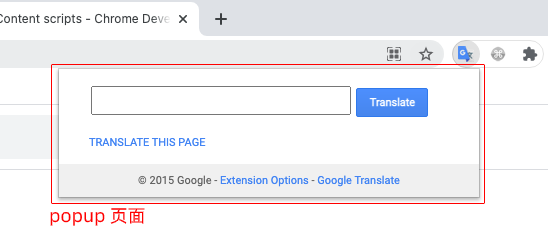
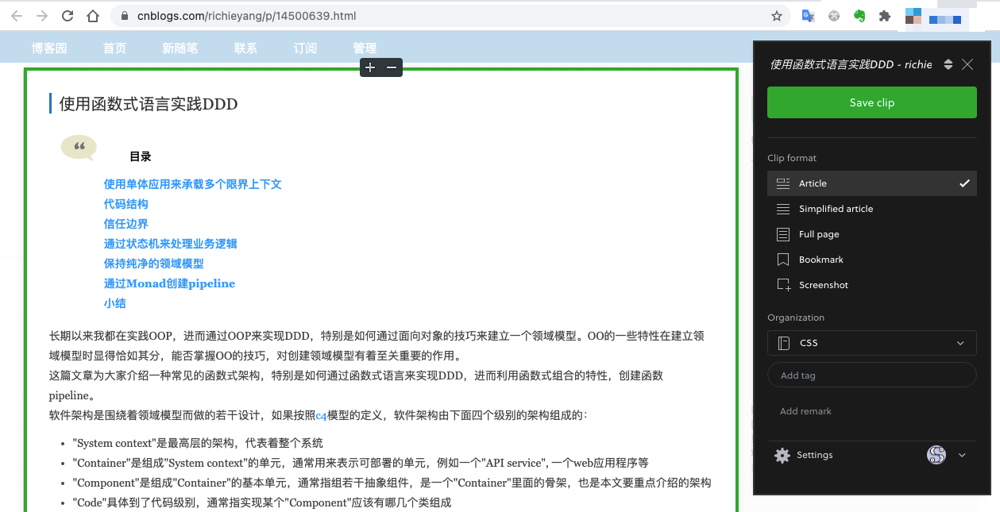

丰富的 chrome 插件极大的提升了我们的工作效率和辛福感，比如大名鼎鼎的 adblock 广告屏蔽、GoFullPage 网页长截图、evernote web clipper 收藏网页。

一般来说，插件会向页面中注入 javascript 脚本，对页面进行处理，比如屏蔽页面中可能的广告元素，改变某些元素的样式。

开发插件需要使用前端技术：html css javascript。

本文就从入门开始讲述如何开发一款 chrome 插件。

注意：chrome 插件机制本身也在更新，本文讲述的是目前普遍使用的 V2 插件的开发。

> Manifest V3 is available beginning with Chrome 88, and the Chrome Web Store begins accepting MV3 extensions in January 2021.

## 插件构成

插件通常由以下几部分组成：

1. [manifest.json](https://developer.chrome.com/docs/extensions/mv2/getstarted/)：相当于插件的 meta 信息，包含插件的名称、版本号、图标、脚本文件名称等，这个文件是每个插件都必须提供的，其他几部分都是可选的。

2. [background script](https://developer.chrome.com/docs/extensions/mv2/background_pages/)：可以调用全部的 chrome 插件 API，实现跨域请求、网页截屏、弹出 chrome 通知消息等功能。相当于插件的后端，默默运行。

3. 功能页面：包括点击插件图标弹出的页面（简称 popup）、插件的配置页面（简称 options）。

4. [content script](https://developer.chrome.com/docs/extensions/mv2/content_scripts/)：早期也被称为 injected script，是插件注入到页面的脚本，但是不会体现在页面 DOM 结构里。content script 可以操作 DOM，但是它和页面其他的脚本是隔离的，访问不到其他脚本定义的变量、函数等，相当于运行在单独的沙盒里。content script 可以调用有限的 chrome 插件 API，网络请求收到同源策略限制。

插件的架构可以参考[官方文档](https://developer.chrome.com/docs/extensions/mv2/architecture-overview/)。

重点说明以下几点：

1. browser action 和 page action：这俩我们可以理解为插件的按钮。browser action 会固定在 chrome 的工具栏。而 page action 可以设置特定的网页才显示图标，在地址栏的右端，如下图：
   

大部分插件点击之后会显示 UI，也就是上文描述的插件功能页面部分，一般称为 popup 页面，如下图：


popup 无法通过程序打开，只能用户点击打开。点击 popup 之外的区域会导致 popup 收起。

2. 由于 content script 受到同源策略的限制，所以一般网络请求都交给 background script 处理。

3. content script、插件功能页面、background script 之间的通信架构如下图：
   

4. chrome 可以打开多个浏览器窗口，而一个窗口会有多个 tab，所以插件的结构大致如下：
   

如上图，每个页面都会注入 content script。

## manifest.json

下文简称 manifest ，其中有这么几个字段可以重点说明：

### content_scripts

举例如下：

```json
{
  "content_scripts": [
    {
      "matches": ["http://*/*", "https://*/*"],
      "run_at": "document_idle",
      "js": ["content.js"]
    }
  ]
}
```

在 manifest 中声明要加载的脚本，各个字段都比较直观。其中 `run_at` 表示在什么时机加载，一般是 `document_idle`，避免 content_scripts 影响页面加载性能。

需要注意的是，如果用户已经打开了 N 个页面，然后再安装插件，这 N 个页面除非重新刷新，否则是不会加载 content_scripts 的。安装插件之后新打开的页面是可以加载 content_scripts 的。

所以需要在用户点击插件图标时，探测页面中的 content_scripts 是否存在（发送消息是否有响应/出错），再提示用户刷新页面。

或者可以在用户点击插件图标时通过 API 注入 content_scripts，代码如下：

```js
chrome.tabs.executeScript({
  file: 'content.js'
});
```

### permissions

该字段是一个数组。

插件调用某些 chrome API 需要申请权限，常见的有：

1. tabs
2. activeTab
3. contextMenus：新增网页邮件菜单
4. cookies：操作 cookie，和用户登录态相关的功能可能会用到该权限
5. storage：插件存储，不是 localStorage。
6. web_accessible_resources：网页能访问的插件内部资源，比如插件提供 SDK 给页面使用，如 ethereum 的 metamask 钱包插件。或者是修改 DOM 结构用到了插件的样式、图片、字体等资源。

permissions 中还可以声明多个 url patterns，表示插件需要访问这些 url，比如和 API 通信。

## background script

下文简称 background，可以理解它是在一个隐藏的 tab 中执行，所在的页面域名为空，这会影响对 cookie 的使用。

比如 background 需要和 a.com 通信。首先应该把 `*://*.a.com/*` 加入到 manifest 的 permissions 数组中。

当发送网络请求时，浏览器会自动带上 a.com 的 cookie，服务器的 set-cookie 也会对浏览器生效。这是符合预期的。

但是读取 document.cookie 时，由于 background 所在的域名为空，a.com 被认为是第三方 cookie，会读取不到。所以需要使用 [chrome.cookies](https://developer.chrome.com/docs/extensions/reference/cookies/) API 来读取 cookie。

background 设置 document.cookie 时，**不能指定域名**，否则会设置失败。比如：

```js
// 会失败，因为指定的域名和 background 所在的域名不符
document.cookie = `session=xxxxxxx; domain=a.com; max-age=9999999999; path=/`;

// 正确的做法，不要指定域名
document.cookie = `session=xxxxxxx; max-age=9999999999`;
```

一般不需要这么操作 cookie，但是可能依赖的 npm 包会操作 document.cookie，所以这里说明一下。

background 使用 tabs 接口操作浏览器的 tab 窗口，比如：

```ts
// 打开新 tab
async function open(url: string): Promise<number> {
  return new Promise((resolve) => {
    chrome.tabs.create(
      {
        url
      },
      (tab) => resolve(tab.id!)
    );
  });
}

// 获取活跃的 tab，通常是用户正在浏览的页面
async function getActiveTab(): Promise<chrome.tabs.Tab | null> {
  return new Promise((resolve) => {
    chrome.tabs.query(
      {
        active: true,
        currentWindow: true
      },
      (tabs) => {
        if (tabs.length > 0) {
          resolve(tabs[0]);
        } else {
          resolve(null);
        }
      }
    );
  });
}

// 将指定的 tab 变成活跃的
async function activate(
  tabId?: number,
  url?: string
): Promise<number | undefined> {
  if (typeof tabId === 'undefined') {
    return tabId;
  }

  // firefox 不支持 selected 参数
  // https://developer.mozilla.org/en-US/docs/Mozilla/Add-ons/WebExtensions/API/tabs/update#parameters
  const options: chrome.tabs.UpdateProperties = IS_FIREFOX
    ? { active: true }
    : { selected: true };
  if (url) {
    options.url = url;
  }

  return new Promise((resolve) => {
    chrome.tabs.update(tabId, options, () => resolve(tabId));
  });
}

// 打开新窗口，或者是激活窗口
async function openOrActivate(url: string): Promise<number> {
  const pattern = getUrlPattern(url);
  return new Promise<number>((resolve) => {
    chrome.tabs.query(
      {
        url: pattern
      },
      (tabs) => {
        if (tabs.length > 0 && tabs[0].id) {
          return Tabs.activate(tabs[0].id);
        } else {
          this.open(url).then((id) => resolve(id));
        }
      }
    );
  });
}
```

## content scripts

下文简称 [content](https://developer.chrome.com/docs/extensions/mv2/content_scripts/)，它只能使用有限的 chrome API。

由于 content 可以访问 DOM，可以用它来选择、修改、删除、增加网页元素。

但是 content 是运行在隔离的空间（类似沙盒），所以如果需要和页面的其他脚本通信，需要采用 `window.postMessage` 的方式。

比如页面内容如下：

```html
<!-- index.html -->
<html>
  <body>
    <div id="app"></div>
    <button id="btn" type="button">submit</button>
  </body>
  <script>
    window.globalData = {
      userId: 12345
    };
  </script>
</html>
```

content 内容如下：

```js
// 成功
document.getElementById('app').innerHTML = 'hello chrome';

// window.globalData 是 undefined
console.log(window.globalData);
```

### 资源注入

content 可以向页面中注入 `<script>`，由此给页面提供 SDK 等功能，注入的脚本和页面自己的脚本一样，都无法和 content 直接通信。

注意：注入的资源要先在 menifest 的 `web_accessible_resources` 字段中声明。

```js
// content 内容
const script = document.createElement('script');
script.src = chrome.runtime.getURL('sdk.js');
document.body.appendChild(script);
```

```js
// sdk.js
window.jsbridge = {
  version: '1.0.1'
  // ...
};
```

content 执行之后，可以看到页面结构多了个 `<script src="chrome-extension://xxxxxxxxxxxxx/sdk.js"></script>`，xxxxxxxx 表示插件的 id，由 chrome 生成。

页面可以调用 sdk，如下：

```js
document.getElementById('btn').addEventListener(
  'click',
  () => {
    console.log(window.jsbridge.version);
  },
  false
);
```

### 通信

content 可以和 background、popup、options 使用 chrome API 通信，参考官方文档：https://developer.chrome.com/docs/extensions/mv2/background_pages/

常用的是 `chrome.runtime.sendMessage`

### UI

content 可以向页面中注入 UI，比如 evernote 的剪辑插件。


点击 popup 之外的区域会导致 popup 收起，操作 DOM 会导致 popup 隐藏，而 **popup 无法用代码主动打开**，所以 evernote 的剪辑插件的 UI 就无法用 popup 来实现了。

这时候可以把 UI 作为 iframe 插入页面，比如：

```js
// content
const app = document.createElement('iframe');
app.src = chrome.runtime.getURL('app.html');
document.body.appendChild(app);
```

神奇的是 iframe 里的 javascript 是可以像 content 一样和 background 通信的。

background 给 iframe 发送消息时，不仅需要指定所在 tab 的 id，还需要指定 iframe 的 id。这里说的 iframe id 类似 tab id，是 chrome 分配的，而不是 iframe 标签的 id 属性。

## 功能页面

popup/options 和 background 的关系很亲密，它们甚至可以通过 `chrome.extension.getBackgroundPage()` 获取到 background 的全局变量。所以它们直接的通信花样很多，不过一般也是用 `chrome.runtime` 通信。

popup/options 和 content 之间的通信方式，可以 background -> content 通信类似。

options 用来设置插件，所以一般需要调用 `chrome.storage` 存储配置。

## 适配其他浏览器

目前 chrome 插件适配工作量是比较小的，因为 edge、opera 都已经切换到 chromium 内核，firefox 也支持 chrome API。

不过需要查看用到的 API 是否支持，以及 API 的入参、出参是否一致。

firefox 还支持 [browser](https://developer.mozilla.org/en-US/docs/Mozilla/Add-ons/WebExtensions) API，和 chrome API 不同的是 browser API 不用回调函数，而是返回 promise。比如：

```js
browser.tabs.query({ currentWindow: true }).then((res) => console.log(res));

chrome.tabs.query({ currentWindow: true }, (res) => {
  console.log(res);
});
```

可以参考各浏览器的开发文档：

- firefox: https://developer.mozilla.org/en-US/docs/Mozilla/Add-ons/WebExtensions/Build_a_cross_browser_extension
- edge: https://docs.microsoft.com/zh-cn/microsoft-edge/extensions-chromium/developer-guide/port-chrome-extension
- 360: http://open.se.360.cn/open/extension_dev/overview.html
- 搜狗: http://ie.sogou.com/open/doc/

## 发布

chrome 发布插件需要花费 5 美元开通账号：https://developer.chrome.com/docs/webstore/register/

firefox 发布文档：https://addons.mozilla.org/en-US/developers/

edge：https://docs.microsoft.com/zh-cn/microsoft-edge/extensions-chromium/publish/create-dev-account

## 总结

总体来说，chrome 插件开发对前端工程师来说还是比较容易的。

mozilla 还提供了高效的开发工具 [web-ext](https://github.com/mozilla/web-ext)。
