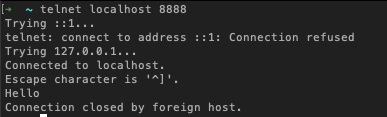
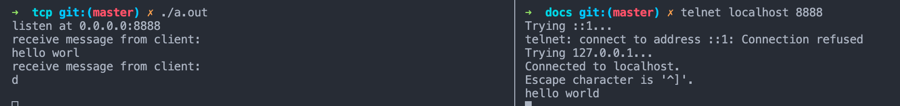
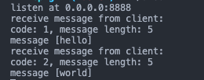

本文从应用的角度以简单直白的代码事例，让大家透彻的理解 TCP 以及 HTTP、RPC、websocket 等常见应用协议。

**阅读文本需要有基础的 TCP/IP 网络模型知识**

TCP/IP 是互联网的基石，随着通信技术的发展，5G 势必会产生更多样的网络应用，而应用又可能会催生新的网络协议（比如 http2/3，webRTC, web 支付）。

作为软件工程师的我们，在面对这些未知挑战时更应该去了解 TCP，它就像是定海神针能够让我们以不变应万变。

## TCP 和 socket

[TCP 协议标准](https://tools.ietf.org/html/rfc793)制定于 1981 年，是一个非常复杂的协议，包括了可靠性保证（握手/挥手、ACK 确认）、拥塞控制算法（滑动窗口、慢启动）等内容。

1983 年 Berkeley 在 BSD4.2 系统中发布了 `Berkeley sockets API`（下文简称 socket） 作为 TCP 的代码实现，之后 socket 被移植到 windows linux 等众多操作系统中。可以说目前我们使用的网络编程技术几乎全部基于 socket。

总结一下：TCP 是非常复杂的协议，socket 是 TCP 的一种代码实现。

下面是一段 socket 代码，我们看看最原始的网络编程是怎样的：

```c
#include <stdio.h>
#include <sys/socket.h>
#include <arpa/inet.h>
#include <unistd.h>
#include <string.h>

int main(int argc, char *argv[])
{
  /* 1. 创建 socket
   * AF_INET 表示用于创建 IPv4 网络的 socket
   * SOCK_STREAM 表示用于 TCP 网络（还可以使用 SOCK_DGRAM 创建 UDP socket）
   * socket 函数文档：https://man7.org/linux/man-pages/man2/socket.2.html
   */
  int socket_fd = socket(AF_INET, SOCK_STREAM, 0);
  if (socket_fd == -1)
  {
    printf("failed to create socket\n");
    return 1;
  }

  // 2. 将 socket 绑定网络接口（IP + 端口）
  struct sockaddr_in address;
  address.sin_family = AF_INET;
  address.sin_addr.s_addr = INADDR_ANY; // 相当于 0.0.0.0
  address.sin_port = htons(8888);
  // https://man7.org/linux/man-pages/man2/bind.2.html
  int code = bind(socket_fd, &address, sizeof(address));
  if (code < 0)
  {
    printf("failed to bind net interface\n");
    return 1;
  }

  // 3. 开始监听连接
  // 第二个参数称为 backlog，用于指定等待连接的队列长度。
  // listen 函数文档，https://man7.org/linux/man-pages/man2/listen.2.html
  code = listen(socket_fd, 1024);
  if (code < 0)
  {
    printf("failed to listen at 0.0.0.0:8888\n");
    return 1;
  }

  printf("listen at 0.0.0.0:8888\n");

  // 4. pending 队列中取出连接
  // https://man7.org/linux/man-pages/man2/accept.2.html
  int conn;
  while ((conn = accept(socket_fd, NULL, NULL)))
  {
    char *message = "Hello\n";
    // 向 client 发送消息
    write(conn, message, strlen(message));
    // 关闭链接
    close(conn);
  }

  close(socket_fd);
  return 0;
}
```

编译执行以上代码，就可以在本地建立 server 了，然后用 telnet 连接：


server 发送了 `Hello` 之后，关闭了链接。

开发 Unix 的大神们（Ken Thompson, Rob Pike 等）又开发了一个名为 [plan9](https://en.wikipedia.org/wiki/Plan_9_from_Bell_Labs) 的操作系统，它的网络编程更为简单，可以参考：http://doc.cat-v.org/plan_9/4th_edition/papers/net/。可惜 plan9 并没有像 Unix 一样有着革命性的影响，反而绝大多数开发者并没有听过这个系统。
不过令人欣慰的是 plan9 的理念被 Go 语言继承下来，并将在现在的网络开发中发挥光热。

## TCP 粘包

为了方便，下面的 server 只处理一条链接。实际开发中，会用多线程加 AIO 的方式并发处理多条链接。

```c
// 更新上文 listen 和 return 之间的代码
const int buffer_size = 11;
char buffer[buffer_size];
for (int i = 0; i < buffer_size; i++) {
  buffer[i] = 0;
}
int conn = accept(socket_fd, NULL, NULL);
while(1) {
  // 每次从链接中最多读取10个字节
  int count = read(conn, &buffer, buffer_size-1);
  if (count == 0) {
    printf("connection end");
    break;
  }
  buffer[count] = 0;
  printf("receive message from client:\n");
  printf("%s\n", buffer);
}
```

重新编译启动 server，再用 telnet 连接 server 发送 `hello world`，查看 server 的输出：


可以看到 server 端把 `hello world` 这么一条完整端消息拆成了两条来处理。

为什么会有这个问题呢？

首先 client 发送的任何数据（文本、JSON、图片、视频、音频）最终都会作为字节在网络中传递，TCP 不知道这些数据是什么，只是一串字节而已。

其次 server 每次只读取 10 个字节，而 client 发送的消息长度为 11 字节，所以 server 分成了两次读取并处理，第 11 个字符在第二次才读取到。

我们可以一次读取更多字节，比如 1024 字节。但是本质的问题并没有解决：如果 client 每次发送的消息长度都是不定的，server 要怎么从一串字节中正确的分割消息呢？

这也就是所谓的 TCP 粘包问题。注意：这不是 TCP 的问题，而是应用层需要处理的问题。

通常有这么几个思路：

1. 保证消息的长度是一致的。缺点是不够灵活。
2. 用一个或几个特定字符作为消息的分隔符。缺点是对消息的编码要求比较高，而且消息的分割效率不高。
3. 消息遵守特定的编码，在消息中包含消息的长度。这是目前比较广泛的做法。

接下来我们按照第 3 种方法实现一个简单的消息编码规则：

1. 首字节表示消息的 code。
2. 接下来的 3 个字节表示消息体的长度。这就说明消息体最多有 1<<24 - 1 个字节，大约 16MB。
3. 后面跟着消息体。

server 的实现如下：

```c
// 替换上文 bind 后面的代码
char msg_hd[4] = {0, 0, 0, 0};
int conn = accept(socket_fd, NULL, NULL);
while (1)
{
  // 先读取消息 code 和长度
  for (int i = 0; i < 4; i++)
  {
    msg_hd[i] = 0;
  }
  int count = read(conn, &msg_hd, 4);
  if (count < 4)
  {
    printf("connection end: short head");
    close(conn);
    break;
  }
  printf("receive message from client:\n");
  char code = msg_hd[0];
  int len = msg_hd[1] + (msg_hd[2] << 8) + (msg_hd[3] << 16);
  printf("code: %d, message length: %d\n", code, len);
  // 读取消息体
  if (len > 0)
  {
    char buffer[len + 1];
    int count = read(conn, &buffer, len);
    if (count < len)
    {
      printf("connection end: short body");
      close(conn);
      break;
    }
    buffer[count] = 0;
    printf("message [%s]\n", buffer);
  }
}
```

由于对消息进行了二进制编码，就不能直接用 telnet 来发起请求了。使用 nodejs 脚本如下：

```js
// client.js
const net = require('net');

const client = net.connect(8888, 'localhost', (conn) => {
  console.log('connected to server.');
});

const hello = Buffer.concat([
  Buffer.from(new Uint8Array([1, 5, 0, 0])),
  Buffer.from('hello', 'ascii')
]);

const world = Buffer.concat([
  Buffer.from(new Uint8Array([2, 5, 0, 0])),
  Buffer.from('world', 'ascii')
]);

// 将两条消息拼接在一起发送
client.write(Buffer.concat([hello, world]));

// node client.js 执行脚本
```

可以看到 server 端：



虽然 client 将两条消息拼接在一起发送，server 还是成功的解析了消息。

## http

前面的例子其实已经实现了一个简易的 RPC 系统。所有应用层的协议都是类似的原理，约定一套**编码**规则，然后对不同种类的消息做不同的处理。

同时，不要忽略的是：TCP 是全双工长链接。server 和 client 之间可以保持连接，并且有来有回的发送很多条消息，除非一方主动或者由于故障断开连接。

DNS、路由器、网卡、CPU 这些硬件付出了巨大的努力才建立一条链接，而 HTTP/1.0 却只用来发送一条请求/响应消息就断开了它，这是多么巨大的资源浪费！

随着万维网的发展，http 1.0 逐渐暴露了网络性能低下的缺陷，包括链接利用率太低、消息头太大，才有了后面的 http 1.1 和 http/2。

我们接下来看看最简单的 http 1.x 协议是如何实现的，核心依然是消息的编码。

非严谨格式举例。请求报文格式如下：

```
<method> <url> HTTP/1.1
<header-field>: <header-value>

<request body>
```

响应报文格式如下：

```
HTTP/1.1 200 OK
Content-Type: text/html
Content-Length: 122
<header-field>: <header-value>

<response body>
```

为了方便理解，改用 js 实现一个简单的 http server：

```js
const net = require('net');

const delimiter = '\r\n';

const server = net.createServer((conn) => {
  conn.setEncoding('utf-8');
  let data = '';

  let method = '';
  let url = '';
  let protocol = '';
  const headers = {};
  let body = '';
  let methodParsed = false;
  let inBody = false;

  function sendResponse() {
    console.log(`method: ${method}, url: ${url}, protocol: ${protocol}`);
    console.log(`headers: ${JSON.stringify(headers, undefined, 2)}`);
    console.log(`body: ${body}`);

    const resBody = `<html>
    <title>Hello HTTP</title>
<body>
  <h1>Hello HTTP</h1>
</body>
</html>`;

    const res = [
      `${protocol} 200 OK`,
      `Content-Type: text/html`,
      `Content-Length: ${resBody.length}`,
      delimiter,
      resBody
    ];

    conn.write(res.join(delimiter));
    conn.end();
  }

  function isRequestEnd() {
    return body.length >= (headers['Content-Length'] || 0);
  }

  conn.on('data', (chunk) => {
    data += chunk;
    if (inBody) {
      if (isRequestEnd()) {
        sendResponse();
      }
      return;
    }

    for (let i = 0; i < data.length; i++) {
      if (data.substr(i, 2) === delimiter) {
        if (data.substr(i + 2, 2) === delimiter) {
          inBody = true;
          data = data.slice(i + 4);
          if (isRequestEnd()) {
            sendResponse();
          }
          break;
        }
        const line = data.slice(0, i);
        if (methodParsed) {
          const [key, value] = line.split(':');
          headers[key] = value;
          console.log(`header: ${key} ${value}`);
        } else {
          [method, url, protocol] = line.split(' ');
          methodParsed = true;
          console.log(`method: ${method}, url: ${url}, protocol: ${protocol}`);
        }
        data = data.slice(i + 2);
      }
    }
  });
});

server.listen(8888);
```

打开浏览器访问 `http://localhost:8888` 可以看到 HTML 页面。

从上面的代码可以看到，HTTP 报文头部的 `Content-Length` 字段说明了请求/响应体的字节长度，和我们前面的简单消息编码类似。

http 的请求体和响应体也是一串字节，但是在收到这些字节应该如何解析呢？

答案是由报文头部的 `Content-Type` 说明这些字节应该如何解码，常见的有 `application/json` 和 `multipart/form-data` 等。这些类型可以告诉接收方应该如何解析这些字节。

### HTTP/2

[HTTP/2](https://developers.google.com/web/fundamentals/performance/http2?hl=zh-cn) 于 2015 年发布，主要是基于 Google 的 SPDY 协议。

针对 HTTP 1.x 的改进如下：

1. 二进制传输。包体积更小，效率更高。
2. 多路复用。同一条 TCP 链接可以处理多个请求响应。
3. Header 压缩。减少每次请求的 header 大小，提高带宽利用率。

可以看到，HTTP/2 的以上特点都是针对 HTTP 1.x 的缺点进行的改进。在理解了 TCP 的原理之后，我们能更容易的理解这些改进，因为从一个高效的通信系统的角度来看，HTTP 1.x 的缺点实在太明显了。

### HTTP/3

HTTP/3 主要是基于 Google 的 [Quic](https://www.chromium.org/quic) 协议，将底层的 TCP 换成了 UDP。

原因是 TCP 为了保证可靠传输，在性能上做了很多妥协，比如每一个数据包的 ACK。而 socket 都被集成到了各大操作系统的内核，内核的更新是比较慢的。

而且由于现在的网络稳定性和带宽相比 20 年前有了很大的改善，Google 决定在 UDP 的基础上增加安全性校验和可靠性算法，推出了 Quic 协议，目的是兼具高效和可靠。

## 总结

虽然 TCP 很难，但是至少在应用层不那么难。
